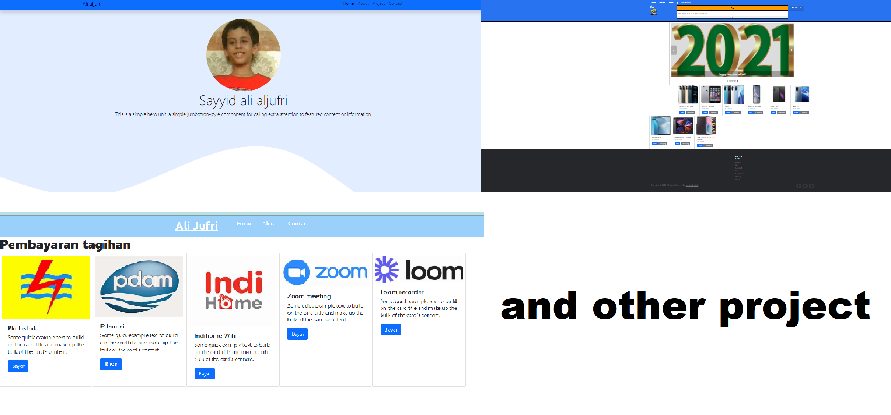

<!--
**Programing-with-ali/Programing-with-ali** is a ✨ _special_ ✨ repository because its `README.md` (this file) appears on your GitHub profile.

Here are some ideas to get you started:

- 🔭 I’m currently working on ...
- 🌱 I’m currently learning ... coding
- 👯 I’m looking to collaborate on ...
- 🤔 I’m looking for help with ...
- 💬 Ask me about ... web developer
- 📫 How to reach me: ...
- 😄 Pronouns: ...
- ⚡ Fun fact: ...
-->

<h1>
 Hi, I'm Ali!
</h1>

A Full-stack web developer JavaScript codes.
 
I'm currently studying at hackerrank, an online school for remote software developers.

 

If you like what you see, and have a project you need coded, don’t hesitate to contact me.
 
Whatsapp:https://chat.whatsapp.com/CZznKlpT8987I94rsUBSLW 
Gmail:sayyidalialjuri8@gmail.com
 
Languages, Frameworks, Tools & Libraries 
JavaScript, HTML5, CSS3, Git, Visualstudiocode, and bootstrap

 
 
 

<h2> <b>Work Experience</b></h2>
js
HackerRank | June 2019 - Present

in Hackerrank I will study js from scracht to web development and front end developer InsyaAllah

<b>Python and Javascript<b>
Tynker | June 2018 - Present

I learn to code and mod Minecraft with Tynker's easy-to-learn, visual programming courses. Tynker makes it fun to learn computer programming for 4th through I have visited this page many times.

<b>Computer since</b>
SoloLearn | September 2020 - November 2020

Why I study in Sololearn's because to study in this for beginners coding in Sololearn's and easy to learn in Hackerrank and if you learn in Sololearn's you will certainly understand and more complete the lessons or methods and blocks in this Sololearn's after I learned in my young Sololearn's understand in Hackerrank

<b>Founder</b>
kawankoding | September 2020 - October 2020

<b>Computer siece</b>
w3schools | November 2019 - February 2020

<b>Software Engineer</b>
Code.org | January 2018 - January 2020

I learned at code.org for me to understand about coding and the course of the program and I was easier to learn about coding is not difficult and quick to understand about coding

   
<h2>My Other Project <b>:</b></h2>
 

